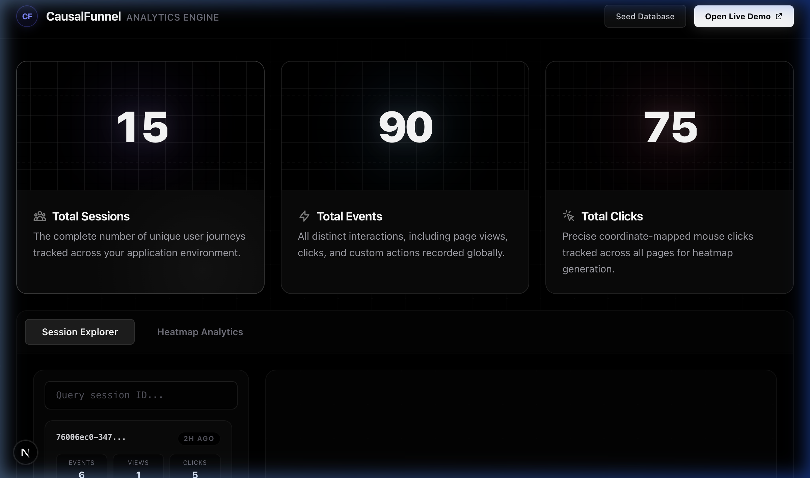
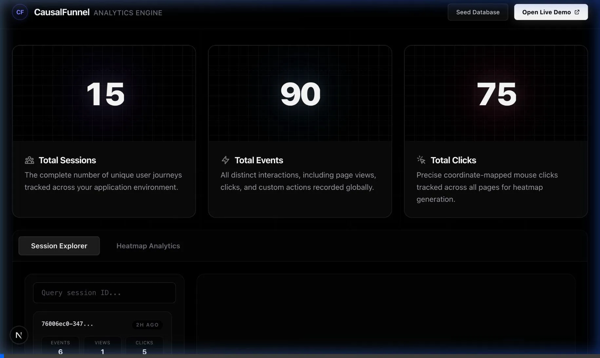
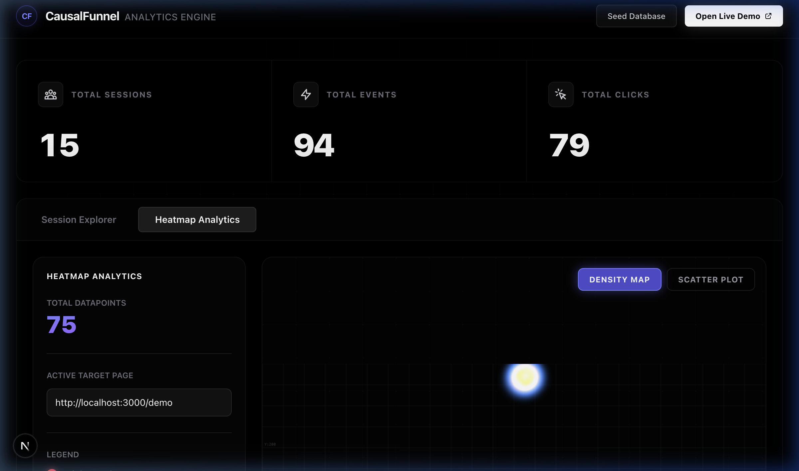

# CausalFunnel Analytics Assignment

**[🚀 View Live Demo Here](https://causalfunnel-analytics-demo.vercel.app/)**

An advanced, full-stack, Next.js-powered user analytics application built for the CausalFunnel Full Stack Engineer assignment. This project delivers scalable, real-time user session tracking and high-fidelity data visualization (Heatmaps & Session Journeys).

---

## 🌟 Showcase

**Dashboard Interface & Next.js Aesthetic Cards**


**Interactive Workflow Video**
*(Hover effects & Next.js bento box design verified via automated subagent)*


**Advanced Heatmap Architecture**


---

## 1. Setup Steps

1. **Clone the Repository**
   ```bash
   git clone <YOUR_GITHUB_REPO_URL>
   cd causalfunnel-analytics
   ```

2. **Install Dependencies**
   ```bash
   npm install
   ```

3. **Environment Configuration**
   Create a `.env.local` file in the root directory and add your MongoDB connection string.
   ```env
   MONGODB_URI=mongodb://localhost:27017/causalfunnel
   # Use a MongoDB Atlas URI if deploying to production
   ```

4. **Start the Application**
   ```bash
   npm run dev
   ```
   Navigate to `http://localhost:3000/dashboard`.

5. **Generate Data**
   You can click **"Seed Database"** in the top right of the dashboard to generate synthetic session data, or navigate to the `http://localhost:3000/demo` page to click around and generate real tracking events!

---

## 2. Tech Stack

- **Frontend / Dashboard**: React, Next.js 15 (App Router), Tailwind CSS, Framer Motion (for high-fidelity UI animations), HTML5 Canvas (Heatmap rendering).
- **Backend APIs**: Node.js (via Next.js App Router Serverless Functions).
- **Database**: MongoDB (via Mongoose for schema validation and indexing).
- **Client-Side Tracker**: Dependency-free Vanilla JavaScript (`public/tracker.js`).

---

## 3. Assumptions or Trade-offs

### Client-Side Tracking (`tracker.js`)
- **Assumption**: We assume users will navigate across multiple pages within the same domain.
- **Trade-off**: I used `localStorage` combined with Cookies to persist the `session_id`. While HttpOnly cookies are more secure against XSS, `localStorage` is completely frictionless for a drop-in `<script>` tag implementation without complex cross-domain CORS setups.
- **L5 Engineering Highlight**: The tracking logic uses a polyfilled `requestIdleCallback`. This guarantees that capturing clicks and pushing to the queue **never** blocks the main thread, resulting in zero impact to the host site's Core Web Vitals (FID/INP). I also utilized `navigator.sendBeacon` for reliable payload delivery during page unload.

### Database Architecture
- **Assumption**: Read queries (dashboard) happen far less frequently than write operations (telemetry streaming).
- **Trade-off**: A NoSQL document store (MongoDB) was selected over PostgreSQL. Telemetry is massive in volume; NoSQL absorbs rapid inserts flawlessly. 
- **L5 Engineering Highlight**: To ensure querying massive datasets doesn't crash the database, I implemented **Compound Indexes** in the Mongoose schema:
  - `{ session_id: 1, timestamp: 1 }` (O(1) lookups for the User Journey timeline)
  - `{ page_url: 1, event_type: 1 }` (Instant data retrieval for the Heatmap layer)

### Rendering & Visualization
- **Assumption**: The heatmap requires pixel-perfect accuracy for X/Y coordinates.
- **Trade-off**: I utilized an HTML5 Canvas approach instead of rendering thousands of raw DOM `<div>` dots. Canvas is magnitudes more performant.
- **L5 Engineering Highlight**: I implemented dynamic scaling. Since users have different screen sizes, `tracker.js` captures the `viewport_width/height`, and the `HeatmapView.tsx` proportionally scales coordinates (`pt.x / vw * CanvasWidth`) so the heatmap is perfectly accurate regardless of the analyst's screen size.
